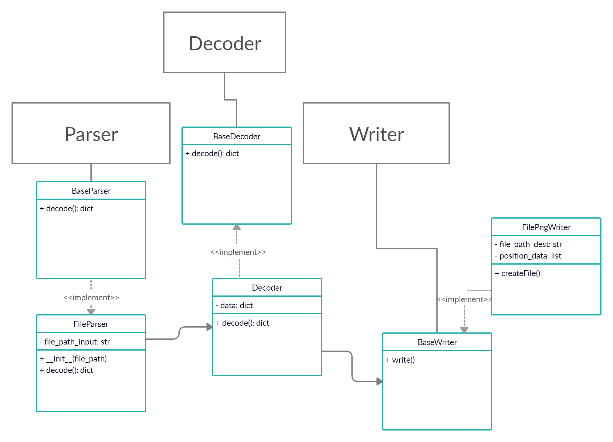

# TM UMl
*Text Markup - Unified Modeling Language*
***
# Install
```
git clone https://github.com/semenInRussia/TM-UML
```
# Get started
###### Windows
```
git clone https://github.com/semenInRussia/TM-UML
pip install -r requirements.txt
```
###### Linux
```
git clone https://github.com/semenInRussia/TM-UML
pip install -r requirements.txt
```
# Contacts
* [trello](https://trello.com/b/JwrfZ6O5/)
# About project
We are use TDD.

This is project outline.



